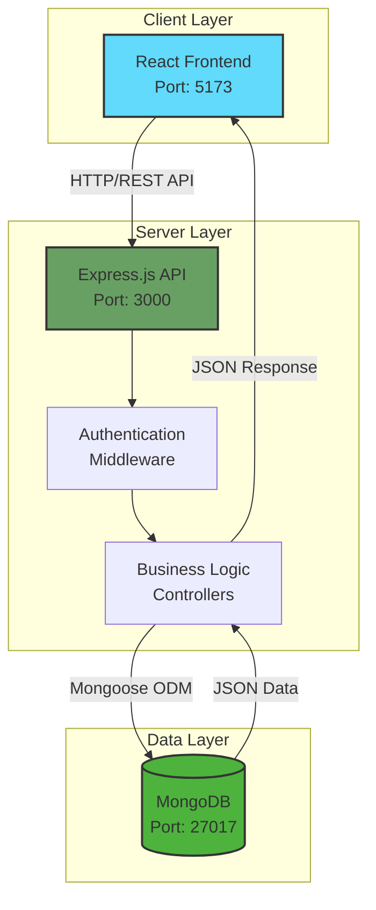
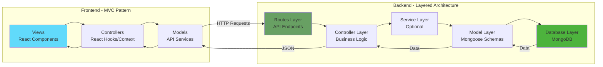
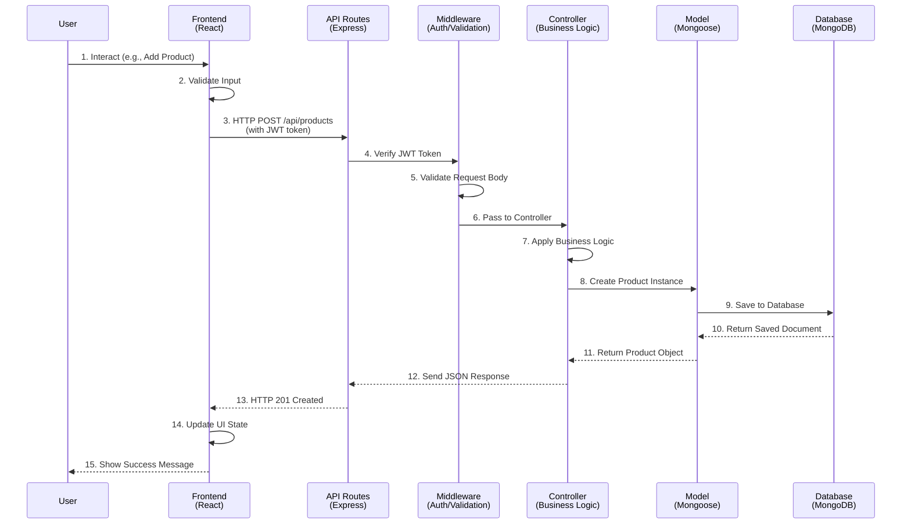
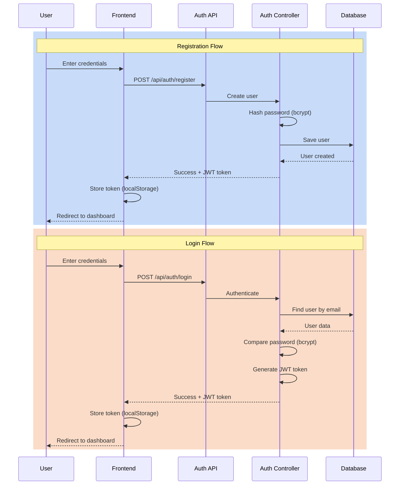
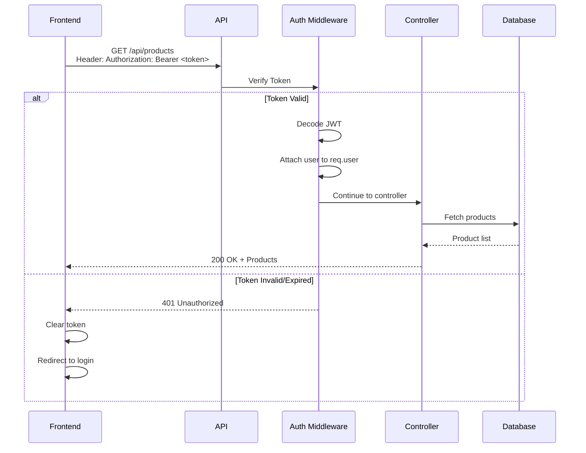
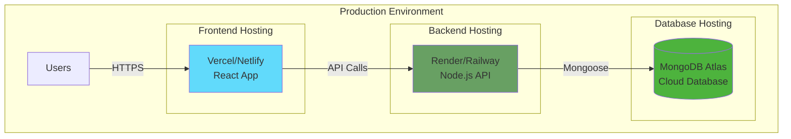

# Inventory Management System - System Architecture

## 1. System Architecture Overview

### High-Level Architecture



### Architecture Pattern: **MVC + Layered Architecture**



---

## 2. Component Responsibilities

### 2.1 Frontend (React.js)

**Responsibilities:**
- **User Interface** - Render components and handle user interactions
- **State Management** - Manage application state (Context API/Redux)
- **Client-side Validation** - Validate forms before submission
- **API Communication** - Make HTTP requests to backend
- **Authentication UI** - Login/logout forms and protected routes
- **Data Presentation** - Display inventory items in tables/cards
- **Routing** - Navigate between pages (React Router)

**Key Features:**
- Dashboard with inventory overview
- Product CRUD operations UI
- User authentication forms
- Responsive design
- Real-time updates
- Search and filter functionality

---

### 2.2 Backend (Express.js + Node.js)

**Responsibilities:**
- **RESTful API** - Expose endpoints for CRUD operations
- **Authentication & Authorization** - JWT-based auth, protect routes
- **Business Logic** - Validate data, enforce business rules
- **Database Operations** - CRUD via Mongoose ODM
- **Error Handling** - Centralized error management
- **Security** - Input sanitization, rate limiting, CORS
- **Logging** - Request/response logging

**Key Features:**
- User registration and login
- JWT token generation and validation
- Product CRUD endpoints
- Category management
- User profile management
- Middleware for auth and validation

---

### 2.3 Database (MongoDB)

**Responsibilities:**
- **Data Persistence** - Store users, products, categories
- **Data Integrity** - Enforce schema validation
- **Relationships** - Reference between collections
- **Indexing** - Optimize query performance
- **Aggregation** - Generate reports and statistics

**Collections:**
- `users` - User accounts and credentials
- `products` - Inventory items
- `categories` - Product categories
- `transactions` - Stock movements (optional)

---

## 3. Folder Structure

### 3.1 Backend Structure

```
backend/
├── config/
│   ├── database.js              # MongoDB connection
│   └── jwt.js                   # JWT configuration
│
├── controllers/
│   ├── authController.js        # Login, register, logout
│   ├── productController.js     # Product CRUD operations
│   ├── categoryController.js    # Category CRUD operations
│   └── userController.js        # User profile management
│
├── middleware/
│   ├── authMiddleware.js        # JWT verification
│   ├── errorHandler.js          # Global error handler
│   ├── logger.js                # Request logging
│   ├── notFound.js              # 404 handler
│   └── validate.js              # Input validation
│
├── models/
│   ├── User.js                  # User schema
│   ├── Product.js               # Product schema
│   └── Category.js              # Category schema
│
├── routes/
│   ├── authRoutes.js            # /api/auth/*
│   ├── productRoutes.js         # /api/products/*
│   ├── categoryRoutes.js        # /api/categories/*
│   ├── userRoutes.js            # /api/users/*
│   └── index.js                 # Route aggregator
│
├── utils/
│   ├── generateToken.js         # JWT token generator
│   └── validators.js            # Validation schemas
│
├── .env                         # Environment variables
├── .env.example                 # Environment template
├── .gitignore                   # Git ignore rules
├── package.json                 # Dependencies
└── server.js                    # Entry point
```

---

### 3.2 Frontend Structure

```
frontend/
├── public/
│   ├── index.html               # HTML template
│   └── favicon.ico              # App icon
│
├── src/
│   ├── assets/                  # Images, fonts, icons
│   │   ├── images/
│   │   └── styles/
│   │
│   ├── components/              # Reusable components
│   │   ├── common/
│   │   │   ├── Navbar.jsx
│   │   │   ├── Footer.jsx
│   │   │   ├── Loader.jsx
│   │   │   ├── Modal.jsx
│   │   │   └── Table.jsx
│   │   │
│   │   ├── auth/
│   │   │   ├── LoginForm.jsx
│   │   │   └── RegisterForm.jsx
│   │   │
│   │   └── products/
│   │       ├── ProductCard.jsx
│   │       ├── ProductForm.jsx
│   │       ├── ProductList.jsx
│   │       └── ProductTable.jsx
│   │
│   ├── context/                 # Context API for state
│   │   ├── AuthContext.jsx      # Auth state
│   │   └── ProductContext.jsx   # Product state
│   │
│   ├── hooks/                   # Custom React hooks
│   │   ├── useAuth.js
│   │   └── useProducts.js
│   │
│   ├── pages/                   # Page components
│   │   ├── Dashboard.jsx
│   │   ├── Login.jsx
│   │   ├── Register.jsx
│   │   ├── Products.jsx
│   │   ├── AddProduct.jsx
│   │   ├── EditProduct.jsx
│   │   └── Profile.jsx
│   │
│   ├── services/                # API service layer
│   │   ├── api.js               # Axios instance
│   │   ├── authService.js       # Auth API calls
│   │   ├── productService.js    # Product API calls
│   │   └── categoryService.js   # Category API calls
│   │
│   ├── utils/                   # Utility functions
│   │   ├── constants.js
│   │   ├── helpers.js
│   │   └── validators.js
│   │
│   ├── routes/                  # Route configuration
│   │   ├── AppRoutes.jsx        # All routes
│   │   └── PrivateRoute.jsx     # Protected routes
│   │
│   ├── App.jsx                  # Root component
│   ├── main.jsx                 # Entry point
│   └── index.css                # Global styles
│
├── .env                         # Environment variables
├── .env.example                 # Environment template
├── .gitignore                   # Git ignore rules
├── package.json                 # Dependencies
├── vite.config.js               # Vite configuration
└── index.html                   # HTML entry
```

---

## 4. Required Dependencies & Tools

### 4.1 Backend Dependencies

**Production:**
```json
{
  "express": "^5.2.1",           // Web framework
  "mongoose": "^9.1.5",          // MongoDB ODM
  "dotenv": "^17.2.3",           // Environment variables
  "cors": "^2.8.6",              // Cross-origin requests
  "bcryptjs": "^2.4.3",          // Password hashing
  "jsonwebtoken": "^9.0.2",      // JWT authentication
  "express-validator": "^7.0.1", // Input validation
  "express-async-handler": "^1.2.0" // Async error handling
}
```

**Development:**
```json
{
  "nodemon": "^3.1.11"           // Auto-restart server
}
```

---

### 4.2 Frontend Dependencies

**Production:**
```json
{
  "react": "^18.2.0",            // UI library
  "react-dom": "^18.2.0",        // React DOM renderer
  "react-router-dom": "^6.22.0", // Routing
  "axios": "^1.6.7",             // HTTP client
  "react-toastify": "^10.0.4",   // Toast notifications
  "react-icons": "^5.0.1"        // Icon library
}
```

**Development:**
```json
{
  "@vitejs/plugin-react": "^4.2.1", // Vite React plugin
  "vite": "^5.1.0"                   // Build tool
}
```

**Optional (State Management):**
```json
{
  "@reduxjs/toolkit": "^2.2.0",  // Redux state management
  "react-redux": "^9.1.0"        // React-Redux bindings
}
```

---

### 4.3 Development Tools

| Tool | Purpose |
|------|---------|
| **Postman** | API testing |
| **MongoDB Compass** | Database GUI |
| **VS Code** | Code editor |
| **Git** | Version control |
| **ESLint** | Code linting |
| **Prettier** | Code formatting |

---

## 5. Data Flow Architecture

### 5.1 Complete Request-Response Flow



---

### 5.2 Authentication Flow



---

### 5.3 Protected Route Flow



---

### 5.4 CRUD Operations Flow

#### **CREATE Product**
```
Frontend → API → Middleware → Controller → Model → Database
         ← JSON ← JSON ← JSON ← Object ← Document ←
```

**Steps:**
1. User fills product form
2. Frontend validates input
3. POST request to `/api/products` with JWT
4. Auth middleware verifies token
5. Validation middleware checks data
6. Controller creates product instance
7. Mongoose saves to MongoDB
8. Success response sent back
9. Frontend updates UI

---

#### **READ Products**
```
Frontend → API → Middleware → Controller → Model → Database
         ← JSON ← JSON ← JSON ← Array ← Documents ←
```

**Steps:**
1. User navigates to products page
2. Frontend sends GET request to `/api/products`
3. Auth middleware verifies token
4. Controller fetches all products
5. Mongoose queries MongoDB
6. Products array returned
7. Frontend renders product list

---

#### **UPDATE Product**
```
Frontend → API → Middleware → Controller → Model → Database
         ← JSON ← JSON ← JSON ← Object ← Document ←
```

**Steps:**
1. User edits product and submits
2. Frontend sends PUT request to `/api/products/:id`
3. Auth middleware verifies token
4. Validation middleware checks data
5. Controller finds and updates product
6. Mongoose updates document
7. Updated product returned
8. Frontend updates UI

---

#### **DELETE Product**
```
Frontend → API → Middleware → Controller → Model → Database
         ← JSON ← JSON ← JSON ← Success ← Deleted ←
```

**Steps:**
1. User clicks delete button
2. Frontend confirms action
3. DELETE request to `/api/products/:id`
4. Auth middleware verifies token
5. Controller finds and deletes product
6. Mongoose removes document
7. Success message returned
8. Frontend removes item from UI

---

## 6. Database Schema Design

### 6.1 User Schema

```javascript
{
  _id: ObjectId,
  name: String (required),
  email: String (required, unique),
  password: String (required, hashed),
  role: String (enum: ['admin', 'user'], default: 'user'),
  createdAt: Date,
  updatedAt: Date
}
```

---

### 6.2 Product Schema

```javascript
{
  _id: ObjectId,
  name: String (required),
  description: String,
  price: Number (required, min: 0),
  quantity: Number (required, min: 0),
  category: ObjectId (ref: 'Category'),
  sku: String (unique),
  image: String (URL),
  createdBy: ObjectId (ref: 'User'),
  createdAt: Date,
  updatedAt: Date
}
```

---

### 6.3 Category Schema

```javascript
{
  _id: ObjectId,
  name: String (required, unique),
  description: String,
  createdAt: Date,
  updatedAt: Date
}
```

---

## 7. API Endpoints Design

### 7.1 Authentication Endpoints

| Method | Endpoint | Description | Auth Required |
|--------|----------|-------------|---------------|
| POST | `/api/auth/register` | Register new user | No |
| POST | `/api/auth/login` | Login user | No |
| POST | `/api/auth/logout` | Logout user | Yes |
| GET | `/api/auth/me` | Get current user | Yes |

---

### 7.2 Product Endpoints

| Method | Endpoint | Description | Auth Required |
|--------|----------|-------------|---------------|
| GET | `/api/products` | Get all products | Yes |
| GET | `/api/products/:id` | Get single product | Yes |
| POST | `/api/products` | Create product | Yes (Admin) |
| PUT | `/api/products/:id` | Update product | Yes (Admin) |
| DELETE | `/api/products/:id` | Delete product | Yes (Admin) |

---

### 7.3 Category Endpoints

| Method | Endpoint | Description | Auth Required |
|--------|----------|-------------|---------------|
| GET | `/api/categories` | Get all categories | Yes |
| GET | `/api/categories/:id` | Get single category | Yes |
| POST | `/api/categories` | Create category | Yes (Admin) |
| PUT | `/api/categories/:id` | Update category | Yes (Admin) |
| DELETE | `/api/categories/:id` | Delete category | Yes (Admin) |

---

### 7.4 User Endpoints

| Method | Endpoint | Description | Auth Required |
|--------|----------|-------------|---------------|
| GET | `/api/users/profile` | Get user profile | Yes |
| PUT | `/api/users/profile` | Update profile | Yes |
| PUT | `/api/users/password` | Change password | Yes |

---

## 8. Security Considerations

### 8.1 Backend Security

- **Password Hashing** - Use bcryptjs with salt rounds ≥ 10
- **JWT Tokens** - Short expiration (1-24 hours), secure secret
- **Input Validation** - Validate all inputs with express-validator
- **CORS** - Configure allowed origins
- **Rate Limiting** - Prevent brute force attacks
- **Helmet.js** - Set security headers
- **SQL Injection** - Mongoose prevents NoSQL injection
- **XSS Protection** - Sanitize user inputs

---

### 8.2 Frontend Security

- **Token Storage** - Store JWT in httpOnly cookies (preferred) or localStorage
- **Protected Routes** - Redirect unauthenticated users
- **Input Sanitization** - Validate before sending to API
- **HTTPS** - Use secure connections in production
- **Environment Variables** - Never expose API keys

---

## 9. Deployment Architecture



**Recommended Platforms:**
- **Frontend**: Vercel, Netlify, GitHub Pages
- **Backend**: Render, Railway, Heroku, DigitalOcean
- **Database**: MongoDB Atlas (free tier available)

---

## 10. Development Workflow

### Phase 1: Backend Setup
- [x] Initialize Node.js project
- [x] Set up Express server
- [x] Configure MongoDB connection
- [x] Create middleware

### Phase 2: Backend Development
- [ ] Create Mongoose models
- [ ] Implement authentication (JWT)
- [ ] Build product CRUD controllers
- [ ] Create API routes
- [ ] Add validation middleware
- [ ] Test with Postman

### Phase 3: Frontend Setup
- [ ] Initialize React project (Vite)
- [ ] Set up React Router
- [ ] Create folder structure
- [ ] Configure Axios

### Phase 4: Frontend Development
- [ ] Build authentication pages
- [ ] Create product components
- [ ] Implement state management
- [ ] Connect to backend API
- [ ] Add error handling

### Phase 5: Integration & Testing
- [ ] End-to-end testing
- [ ] Fix bugs
- [ ] Optimize performance
- [ ] Deploy to production

---

## Summary

This architecture provides:

**Scalable Structure** - Modular design for easy expansion  
**Security** - JWT auth, password hashing, validation  
**Maintainability** - Clear separation of concerns  
**RESTful API** - Standard HTTP methods and JSON  
**Modern Stack** - MERN with latest best practices  
**Production-Ready** - Error handling, logging, deployment strategy  

The system is designed to handle inventory management efficiently while maintaining code quality and security standards.
