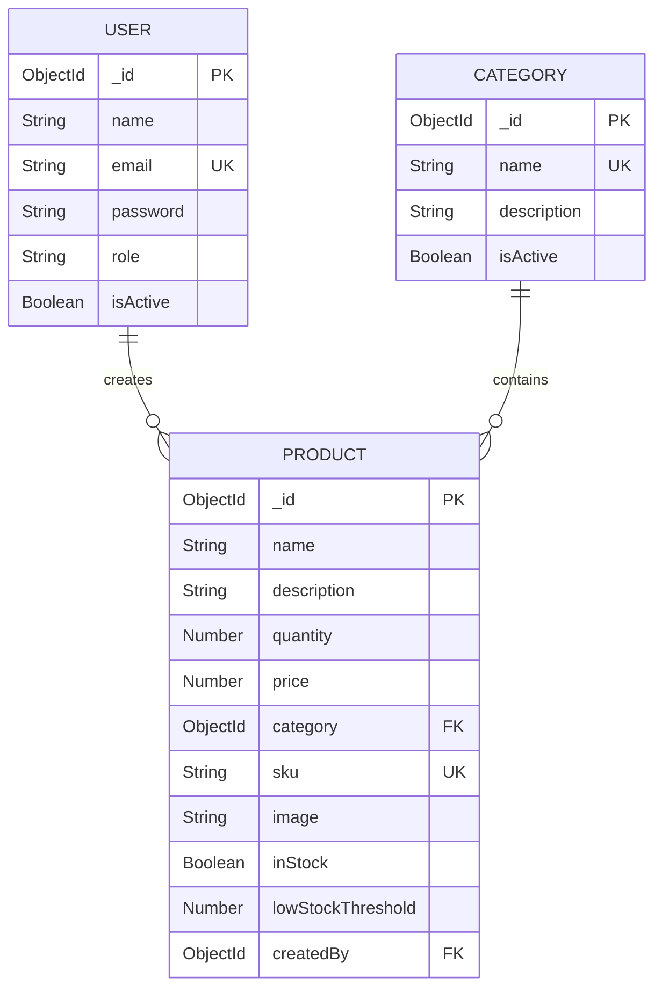

# MongoDB Schemas Documentation

## Overview

This document explains the Mongoose schemas for the Inventory Management System, including validation rules, relationships, and special features.

---

## 1. User Schema

**File:** [`models/User.js`](file:///home/fareed/Documents/GitHub/Inventory-Management-System/backend/models/User.js)

### Schema Structure

```javascript
{
  name: String,
  email: String,
  password: String,
  role: String,
  isActive: Boolean,
  createdAt: Date,    // Auto-generated
  updatedAt: Date     // Auto-generated
}
```

### Field Specifications

| Field | Type | Required | Validation | Notes |
|-------|------|----------|------------|-------|
| `name` | String | yes | 2-50 characters, trimmed | User's full name |
| `email` | String | yes | Valid email format, unique, lowercase | Authentication identifier |
| `password` | String | yes | Min 6 characters, hashed | Not returned in queries by default |
| `role` | String | no | Enum: `user`, `admin` | Default: `user` |
| `isActive` | Boolean | no | - | Default: `true` |

### Special Features

#### **Password Hashing**
```javascript
// Automatically hashes password before saving
userSchema.pre("save", async function (next) {
    if (!this.isModified("password")) return next();
    const salt = await bcrypt.genSalt(10);
    this.password = await bcrypt.hash(this.password, salt);
    next();
});
```

#### **Password Comparison Method**
```javascript
// Usage in authentication
const isMatch = await user.comparePassword(candidatePassword);
```

#### **Security**
- Password field has `select: false` - not included in queries by default
- `toJSON()` method removes password from response
- Email is automatically converted to lowercase
- Email uniqueness enforced at database level

### Indexes

```javascript
{ email: 1 }  // Faster email lookups for authentication
```

---

## 2. Category Schema

**File:** [`models/Category.js`](file:///home/fareed/Documents/GitHub/Inventory-Management-System/backend/models/Category.js)

### Schema Structure

```javascript
{
  name: String,
  description: String,
  isActive: Boolean,
  createdAt: Date,    // Auto-generated
  updatedAt: Date     // Auto-generated
}
```

### Field Specifications

| Field | Type | Required | Validation | Notes |
|-------|------|----------|------------|-------|
| `name` | String | yes | 2-50 characters, unique, trimmed | Category identifier |
| `description` | String | no | Max 500 characters, trimmed | Optional details |
| `isActive` | Boolean | no | - | Default: `true` |

### Special Features

#### **Virtual Field - Products**
```javascript
// Get all products in this category
categorySchema.virtual("products", {
    ref: "Product",
    localField: "_id",
    foreignField: "category",
});

// Usage
const category = await Category.findById(id).populate("products");
console.log(category.products); // Array of products
```

### Indexes

```javascript
{ name: 1 }  // Faster category name lookups
```

---

## 3. Product Schema

**File:** [`models/Product.js`](file:///home/fareed/Documents/GitHub/Inventory-Management-System/backend/models/Product.js)

### Schema Structure

```javascript
{
  name: String,
  description: String,
  quantity: Number,
  price: Number,
  category: ObjectId,
  sku: String,
  image: String,
  inStock: Boolean,
  lowStockThreshold: Number,
  createdBy: ObjectId,
  createdAt: Date,    // Auto-generated
  updatedAt: Date     // Auto-generated
}
```

### Field Specifications

| Field | Type | Required | Validation | Notes |
|-------|------|----------|------------|-------|
| `name` | String | yes | 2-100 characters, trimmed | Product name |
| `description` | String | yes | 10-1000 characters, trimmed | Product details |
| `quantity` | Number | yes | Min: 0, integer only | Current stock level |
| `price` | Number | no | Min: 0, max 2 decimals | Default: 0 |
| `category` | ObjectId | yes | Valid Category reference | Links to Category |
| `sku` | String | no | Uppercase, alphanumeric + hyphens, unique | Stock Keeping Unit |
| `image` | String | no | Valid URL format | Product image URL |
| `inStock` | Boolean | no | Auto-calculated | Updated automatically |
| `lowStockThreshold` | Number | yes | Min: 0 | Default: 10 |
| `createdBy` | ObjectId | no | Valid User reference | Links to User |

### Special Features

#### **Virtual Fields**

```javascript
// Check if stock is low
product.isLowStock  // true if quantity <= lowStockThreshold

// Check if out of stock
product.isOutOfStock  // true if quantity === 0
```

#### **Automatic Stock Status**

```javascript
// Pre-save middleware updates inStock automatically
productSchema.pre("save", function (next) {
    this.inStock = this.quantity > 0;
    next();
});
```

#### **Instance Methods**

```javascript
// Update quantity safely
await product.updateQuantity(5);   // Add 5
await product.updateQuantity(-3);  // Remove 3
// Throws error if quantity would go negative
```

#### **Static Methods**

```javascript
// Find products with low stock
const lowStockProducts = await Product.findLowStock();

// Find out of stock products
const outOfStockProducts = await Product.findOutOfStock();
```

### Indexes

```javascript
{ name: 1, category: 1 }  // Compound index for filtered searches
{ sku: 1 }                // Unique SKU lookups
{ quantity: 1 }           // Stock level queries
```

---

## 4. Schema Relationships

### Relationship Diagram



### Relationship Details

#### **User → Product (One-to-Many)**
- **Type:** Reference
- **Field:** `Product.createdBy` → `User._id`
- **Purpose:** Track which user created each product
- **Cascade:** Not implemented (products remain if user deleted)

```javascript
// Populate creator information
const product = await Product.findById(id).populate("createdBy", "name email");
console.log(product.createdBy.name);
```

#### **Category → Product (One-to-Many)**
- **Type:** Reference
- **Field:** `Product.category` → `Category._id`
- **Purpose:** Organize products into categories
- **Virtual:** `Category.products` provides reverse lookup

```javascript
// Get all products in a category
const category = await Category.findById(id).populate("products");
console.log(category.products); // Array of products

// Get category for a product
const product = await Product.findById(id).populate("category");
console.log(product.category.name);
```

---

## 5. Validation Rules Summary

### User Validation
-  Email must be unique and valid format
-  Password minimum 6 characters
-  Name 2-50 characters
-  Role must be 'user' or 'admin'

### Category Validation
-  Name must be unique
-  Name 2-50 characters
-  Description max 500 characters

### Product Validation
-  Name 2-100 characters
-  Description 10-1000 characters
-  Quantity must be non-negative integer
-  Price must be non-negative with max 2 decimals
-  SKU must be uppercase alphanumeric (if provided)
-  Image must be valid URL (if provided)
-  Category must reference existing category
-  CreatedBy must reference existing user

---

## 6. Usage Examples

### Creating a User

```javascript
const User = require("./models/User");

const user = await User.create({
    name: "John Doe",
    email: "john@example.com",
    password: "password123",  // Will be hashed automatically
    role: "admin"
});

// Password is automatically hashed before saving
```

### Authenticating a User

```javascript
const user = await User.findOne({ email: "john@example.com" }).select("+password");

if (user && await user.comparePassword("password123")) {
    console.log("Authentication successful");
}
```

### Creating a Category

```javascript
const Category = require("./models/Category");

const category = await Category.create({
    name: "Electronics",
    description: "Electronic devices and accessories"
});
```

### Creating a Product

```javascript
const Product = require("./models/Product");

const product = await Product.create({
    name: "Laptop",
    description: "High-performance laptop for professionals",
    quantity: 50,
    price: 999.99,
    category: categoryId,  // ObjectId of category
    sku: "LAP-001",
    image: "https://example.com/laptop.jpg",
    lowStockThreshold: 10,
    createdBy: userId  // ObjectId of user
});
```

### Querying with Relationships

```javascript
// Get product with category and creator info
const product = await Product.findById(productId)
    .populate("category", "name description")
    .populate("createdBy", "name email");

console.log(product.category.name);
console.log(product.createdBy.name);
```

### Using Virtual Fields

```javascript
const product = await Product.findById(productId);

if (product.isLowStock) {
    console.log("Warning: Low stock!");
}

if (product.isOutOfStock) {
    console.log("Out of stock!");
}
```

### Using Static Methods

```javascript
// Find all low stock products
const lowStock = await Product.findLowStock();

// Find all out of stock products
const outOfStock = await Product.findOutOfStock();
```

### Updating Quantity Safely

```javascript
const product = await Product.findById(productId);

try {
    await product.updateQuantity(-5);  // Sell 5 units
    console.log("Stock updated");
} catch (error) {
    console.log("Insufficient stock");
}
```

---

## 7. Best Practices Implemented

###  Security
- Password hashing with bcrypt (salt rounds: 10)
- Password excluded from queries by default
- Email stored in lowercase to prevent duplicates

###  Data Integrity
- Required fields enforced
- Validation rules for all inputs
- Unique constraints on email and SKU
- Foreign key references with ObjectId

###  Performance
- Indexes on frequently queried fields
- Compound indexes for common query patterns
- Sparse index on optional unique field (SKU)

###  Maintainability
- Clear field names and validation messages
- Middleware for automatic calculations
- Helper methods for common operations
- Virtual fields for computed values

###  Scalability
- Reference relationships (not embedded)
- Efficient indexing strategy
- Timestamps for audit trails

---

## 8. Database Indexes Summary

| Model | Index | Type | Purpose |
|-------|-------|------|---------|
| User | `email` | Single, Unique | Fast authentication lookups |
| Category | `name` | Single, Unique | Fast category searches |
| Product | `name, category` | Compound | Filtered product searches |
| Product | `sku` | Single, Unique, Sparse | SKU lookups |
| Product | `quantity` | Single | Stock level queries |

---

## Summary

**Three production-ready schemas** - User, Category, Product  
**Comprehensive validation** - All fields validated with clear error messages  
**Security built-in** - Password hashing, secure defaults  
**Relationships defined** - User→Product, Category→Product  
**Helper methods** - Password comparison, quantity updates, stock queries  
**Virtual fields** - Computed values without database storage  
**Automatic behaviors** - Stock status updates, password hashing  
**Performance optimized** - Strategic indexing for common queries  
